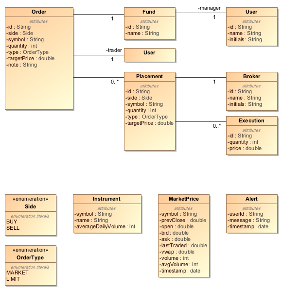
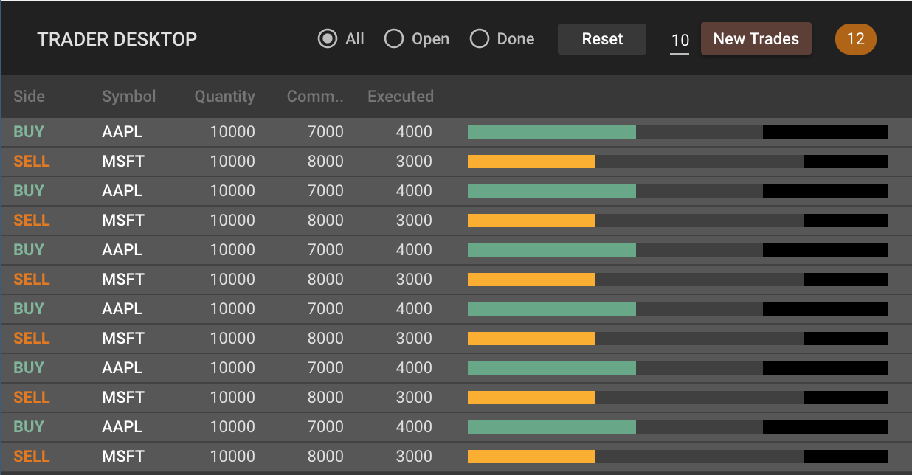

React Learning Path
===================
*React Learning Path* is an approach to learn React using real-life business problems. I will pose a problem, provide some learning resources and have you solve the problem using what you have learned. In my experience, learning happens by creating a plan, executing it, making mistakes and attempting again. So that others get the opportunity to go through this learning process, I request that you don't publish your solutions. Thanks for your understanding.

Tech Stack
----------
I have a preferred (very opinionated) tech stack which you may use, or you can substitute specific elements with your preferences. Without further due, here's my preferred stack:

| Feature                       | Preferred Technology                          | Alternate
|-------------------------------|-----------------------------------------------|-----------
| Base UI library               | React                                         |
| Language                      | TypeScript                                    | ES2015
| Styling framework             | Material UI (CSS-in-JS and theming)           | Glamorous
| Reusable components framework | Monorepo architecture, Lerna, Yarn Workspaces |
| State management              | MobX                                          | Redux
| Routing                       | mobx-state-router                             |
| Testing                       | Jest, Enzyme, Storybook, Puppeteer            |

Business Domain
---------------
We will ue a financial business domain for our exercises, specifically *Equities Trading*. At a very high-level, the business process involves:
- A fund manager sending trading instructions to a trader to buy or sell a stock
- The trader placing trades with one or more brokers to maximize profits (or minimize losses)

Here's the domain model of the business problem. The description below should help understand what it means. If you want to understand the notation in more detail, you can read my [Domain-Drive Design](https://archfirst.org/domain-driven-design/) article.

Fund managers request the buying or selling of a stock by placing an *Order* into the system. The order is assigned to a trader who is responsible for placing the trade with a broker. If the order is too big and has the potential of inefficient execution (e.g. moving the market in an unfavorable direction), the trader may decide to split the order into multiple *Placements* and place each one with a different broker.

Each placement may be fulfilled in the market in one or more chunks, known as *Executions*. For example, a purchase of 1,000,000 shares may be fulfilled using ten executions of 100,000 shares.

Some more terminology:
- The total quantity that is placed with one or more brokers is also called the quantity *committed*.
- The total quantity that is executed is also called the quantity *done*. 

The system receives market prices for all equities of interest. This information is vital for traders to trade efficiently.

Finally, the system is able to send alerts to individual users, e.g. when a new order has been entered for a trader.

Visual Design
-------------
The series of exercises will lead us to a React app that displays the current state of orders in the system. The visual design of this app is shown below. It is a highly simplified version of a *Trade Blotter* and does not use the full complexity of the domain model described above. However there is enough in here to learn the fundamentals of building robust enterprise applications. You will learn
- How to dissect the screen into smaller testable components
- How to share reusable components with multiple applications
- How to cleanly make the state of the application available to your components
- How to style your components in a completely encapsulated way, but still overridable

